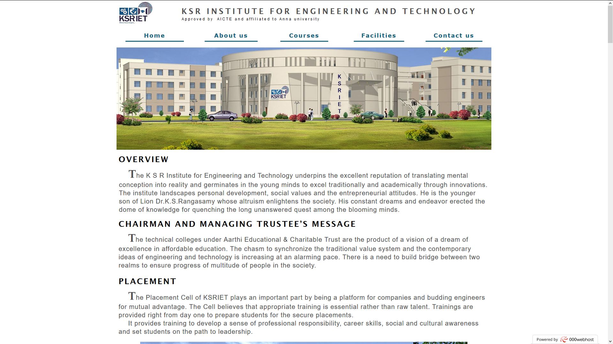

# Simple Responsive Site
Hey There, This is my first simple Responsive Website. I completed this project by using Adobe Muse.

## About Adobe Muse
* Adobe Muse is a website builder that allows designers to create fixed, fluid, and adaptive websites without having to write any code. 
* Muse generates static websites giving users the freedom to host their sites with any hosting provider.

## Screenshot

